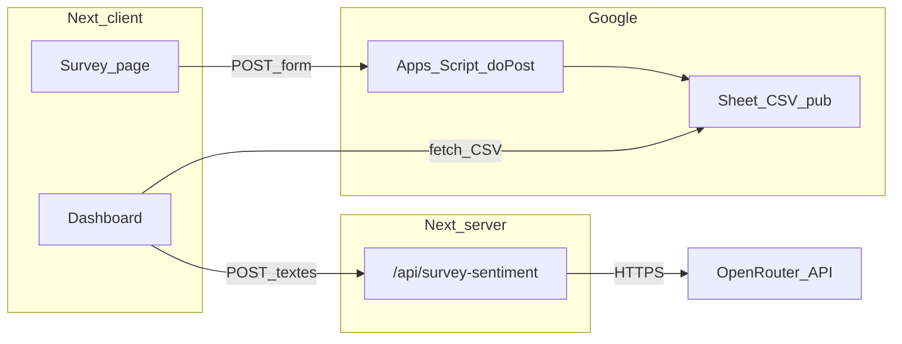

# Plan — Questionnaire Communication Managériale v2 + Google Apps Script + Dashboard

## Contexte actuel

- Le flux principal est Next.js : [`app/survey/page.js`](app/survey/page.js) (formulaire unique, 35 questions, Likert « Pas du tout / Tout à fait »).
- L’envoi POST utilise `GOOGLE_SCRIPT_URL` (même URL dupliquée dans [`form.js`](form.js) pour l’ancien [`index.html`](index.html)).
- [`google-script.gs`](google-script.gs) écrit une ligne avec en-têtes allant jusqu’à `Q35_Ameliorations` et attend `e.parameter.q1` … `q35` en **minuscules** (aligné avec les `name` du formulaire).
- Le dashboard [`app/dashboard/page.js`](app/dashboard/page.js) lit le CSV publié, calcule une moyenne sur `Q6`–`Q33`, et plusieurs graphiques sont incohérents ou simplistes (ex. radar sur une seule colonne, `Line` sur `Q6` seul). Le split CSV par `row.split(',')` **cassera** dès que Q26/Q27 contiennent des virgules ou guillemets.

## 1. Modèle de données (aligné spec v2)

| Zone | Champs | Notes |
|------|--------|--------|
| Démographie | `q1`–`q5` | Libellés et options **exactement** comme dans votre spec (départements, tranches ancienneté 3 niveaux, âge 3 tranches, etc.). |
| Likert 1–4 | `q6`–`q25` | Jamais / Rarement / Souvent / Toujours — 5 dimensions × 4 items (ordre spec). |
| Ouvert (optionnel) | `q26`, `q27` | Max 500 caractères côté UI + validation ; autorisés vides à l’envoi. |

**En-têtes Google Sheet proposés** (ligne 1, cohérents avec le dashboard) :  
`Date/Heure`, `Q1_Filiere`, `Q2_Niveau_Etudes`, `Q3_Anciennete`, `Q4_Niveau_Hierarchique`, `Q5_Age`, `Q6`…`Q25`, `Q26_Points_Forts`, `Q27_Ameliorations`.  
Plus de colonnes `Q28`–`Q35`.

**Migration** : les feuilles déjà remplies avec l’ancien schéma ne sont pas compatibles sans script de migration ; prévoir une **nouvelle feuille** ou une nouvelle onglet + publication CSV mise à jour (`CSV_URL` + `GOOGLE_SCRIPT_URL` après redéploiement GAS).

## 2. Survey Next.js — contenu + UX en étapes

**Fichier principal** : [`app/survey/page.js`](app/survey/page.js).

- Remplacer `sections` par la structure v2 (1 bloc démo + 5 blocs Likert + 1 bloc ouvert).
- Remplacer `likertOptions` par les 4 niveaux de la spec ; retirer la fausse légende « 1 = Pas du tout d’accord » sur les sections démo (actuellement affichée dès qu’il y a un `select`).
- **Wizard** : état `currentStep` (0..6), afficher **une seule** section à la fois.
  - Boutons **Précédent** / **Suivant** ; **Suivant** valide uniquement l’étape courante (tous les `required` de l’étape remplis ; Likert + selects démo ; Q26/Q27 non requis).
  - Dernière étape : bouton **Envoyer** qui déclenche le même `fetch` qu’aujourd’hui (`URLSearchParams` sur l’objet `formData` incluant les champs vides optionnels omis ou envoyés comme chaînes vides — à coordonner avec GAS).
- **Animations + personnages** : sans ajouter de lourde dépendance par défaut, prévoir un petit composant client (ex. [`app/survey/SurveyMascot.js`](app/survey/SurveyMascot.js)) avec **7 variantes** (une par étape) : illustrations **SVG inline** (silhouettes / poses différentes, couleurs distinctes) + **CSS** (`@keyframes` : entrée type `translateY` + `opacity`, léger « bounce »). Ré-animer à chaque changement d’étape via une `key={step}` sur le conteneur du personnage.
- Styles : compléter [`app/globals.css`](app/globals.css) (barre de progression optionnelle, layout étape, zone mascotte, transitions).

**Config** : extraire `GOOGLE_SCRIPT_URL` vers une variable d’environnement Next (`NEXT_PUBLIC_GOOGLE_SCRIPT_URL`) pour éviter les URLs en dur ; documenter dans README le remplissage après déploiement GAS.

**Fichiers legacy** : si vous conservez [`index.html`](index.html) + [`form.js`](form.js), soit les mettre à jour en parallèle (même schéma + 7 sections), soit indiquer dans README qu’ils sont dépréciés au profit de `/survey` — à trancher selon usage réel.

## 3. Google Apps Script — recréation

**Fichier** : [`google-script.gs`](google-script.gs).

- `doPost` : si `sheet.getLastRow() === 0`, `appendRow` avec la **nouvelle** liste d’en-têtes (27 champs + timestamp).
- Construire `rowData` avec `e.parameter.q1` … `e.parameter.q27` uniquement (plus `q28`–`q35`).
- Conserver l’échappement CSV dans `doGet` (déjà présent) pour les exports.
- **Déploiement** : nouvelle version « Application web », exécuter en tant que moi, accès « Tout le monde » ; coller la nouvelle URL dans `NEXT_PUBLIC_GOOGLE_SCRIPT_URL` (et `form.js` si conservé).

## 4. Dashboard — fiabilité, science, anonymat, OpenRouter

**Fichier** : [`app/dashboard/page.js`](app/dashboard/page.js) (+ éventuellement [`lib/surveyStats.js`](lib/surveyStats.js) pour tests/clarté).

- **Parsing CSV** : remplacer `split(',')` par un parseur compatible guillemets/retours ligne (petite fonction RFC4180 ou dépendance minimale type `papaparse` si vous préférez une lib éprouvée). Indispensable pour Q26/Q27.
- **Lecture des colonnes** : moyennes et graphiques Likert uniquement sur `Q6`–`Q25` (entiers 1–4).
- **IQC pondéré** (spec) : pour chaque réponse, moyenne par dimension puis  
  `0.28*Clarte + 0.26*Ecoute + 0.22*Transparence + 0.14*Coherence + 0.10*Accessibilite` ; afficher IQC moyen sur l’échantillon + répartition ou tendance.
- **Alpha de Cronbach** : fonction utilitaire par dimension (4 items) sur la matrice des scores ; afficher α par dimension avec interprétation (seuil 0,70) — calcul entièrement côté client à partir des lignes CSV.
- **Indicateur Kaiser** : bannière selon `n` : `n >= 200` fiable, `30 <= n < 200` tendances, `n < 30` insuffisant (libellés sans emoji ou avec classes CSS si vous voulez éviter les caractères emoji dans l’UI).
- **Anonymat démographie (≤5)** : pour chaque graphique démo (`Q1_Filiere`, …, `Q5_Age`), regrouper les modalités dont l’effectif ≤ 5 dans une catégorie du type **« Masqué (≤5) »** (ou masquer la section démo entière si `n` global ≤ 5 — la spec parle de « groupe concerné », interprétation retenue : **par modalité**).
- **Graphiques** : radar / barres par **dimension** (moyenne de Q6–Q9, etc.), pas une seule question ; corriger la carte « Scores moyens par dimension » pour utiliser des séries réelles.
- **Sentiment OpenRouter** (votre choix) :
  - Ajouter [`app/api/survey-sentiment/route.js`](app/api/survey-sentiment/route.js) (Route Handler) : lit `process.env.OPENROUTER_API_KEY` (et modèle via `OPENROUTER_MODEL`, défaut raisonnable), accepte un body JSON limité (ex. textes concaténés ou liste courte) et renvoie JSON structuré (positif/neutre/négatif + courte justification).
  - Le dashboard appelle cette route **sur action utilisateur** (« Analyser les réponses ouvertes ») ou au chargement avec **plafond** (ex. derniers 50 segments de texte) pour limiter coût/latence ; afficher synthèse + avertissement si pas de clé.
  - Ne jamais exposer la clé côté client.

## 5. Documentation

- Mettre à jour [`README.md`](README.md) : nouveau nombre de questions, colonnes Sheet, variables `NEXT_PUBLIC_GOOGLE_SCRIPT_URL`, `OPENROUTER_API_KEY`, instructions GAS + publication CSV pour le dashboard.

## Ordre d’implémentation recommandé

1. Schéma commun (noms `q1`–`q27` + en-têtes Sheet) + `google-script.gs` + test manuel POST.
2. Refonte [`app/survey/page.js`](app/survey/page.js) (données v2 + wizard + validations + mascottes + limites 500).
3. Utilitaires stats + parse CSV + refonte calculs/graphiques + anonymat + Kaiser + IQC + Cronbach dans le dashboard.
4. Route API OpenRouter + intégration UI dashboard.
5. README + nettoyage URLs (env) + optionnel alignement `form.js` / `index.html`.

## Hors périmètre (sauf demande explicite)

- **ACP** complète dans le navigateur : coûteuse à maintenir ; la spec peut être satisfaite par export CSV vers JASP/SPSS + mention dans README. On peut ajouter plus tard un module dédié si besoin.
